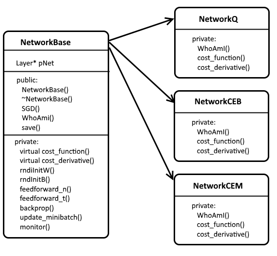
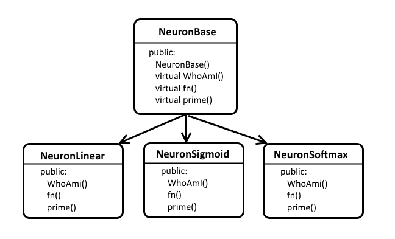

# ML Basic C Implementation

**Machine Learning Basics in C++**

Copyright (c) Pius Braun 2018

[TOC]

------


## Files, Libraries, Datasets

#### The Source Code

| File        | Description                                                  |
| ----------- | ------------------------------------------------------------ |
| network.cpp | contains the `main()`function and the classes                |
| nwhelpers.h | header-only include file with some supporting functions      |
| nwparam.h   | header-only include file with commandline parsing and network parameters |

#### The MNIST Dataset

The "Modified National Institute of Standards and Technology" dataset is a large set of handwritten digits.

Like Michael A. Nielsen, I use the MNIST dataset for test and demostration purpose. 


You should download it from Yann Lecun's [site](http://yann.lecun.com/exdb/mnist/), since i use the IDX file format, that is described there.

I use the training data for training the model and the test data for evaluation. I do not use any dataset for the verification of hyper parameters.

#### The Eigen Matrix Library

My code uses the Dense Matrix classes from [Eigen](http://eigen.tuxfamiliy.org).

Eigen is primarily MPL2 licensed (see: http://www.mozilla.org/MPL/2.0/).

I installed the latest stable release 3.3.4 from www.tuxfamily.org in the `MinGW\x86_64-w64-mingw32\include` directory.

#### Compiler, O-S, Hardware

I use the MinGW environment (see http://www.mingw.org)

```
c:> g++ --Version
g++ (x86_64-posix-seh-rev0, Built by MinGW-W64 project) 7.1.0
Copyright (C) 2017 Free Software Foundation, Inc.
This is free software; see the source for copying conditions.  There is NO
warranty; not even for MERCHANTABILITY or FITNESS FOR A PARTICULAR PURPOSE.
```


## Classes

I implement 2 classes, one for the Network itself and one for the Neurons.

The Network Class contains the basic code for training and together with it's derivatives the different types of Cost Functions.

Details are descibed in the [Specification](Specification.md).



The function `WhoAmI()` returns a String with the name of the Cost Function.

The function `cost_function()`calculates the costs (running the derived cost function) and returns it as a `Double` number.

The function `cost_derivative()`returns the specific gradients that are needed for the Backpropagation Step 1 (see [Specification](Specification.md)).

The Neuron class and it's derived classes define the different types of Neurons. 



The function `WhoAmI()` returns a String with the name of the Neuron Function.

The function `fn()` runs the Neuron Function.

The function prime() returns gradients as a result of the derivative of the Neuron Function. It is used in the second Term of Step 1 and Step 3 of the Backpropagation algorithm. Again, see the [Specification](Specification.md). 

------


## Command Line

The command line arguments define the structure of the network and the training parameters.

```
c:>network -?

Detailed usage: network -L <layers> -N <neurons> -T <training files> [options]

  -L <layers>          List (integer numbers) of the number of neurons if each
                       layer 1..n (except input layer 0), separated by comma.
  -N <neurons>         Type of neuron in every layer 1..n, separated by comma.
                       Each one of:
                         A: Linear  a = z
                         B: Sigmoid a = 1/(1-exp(-z))
                         C: Softmax a = exp(z_i)/sum(exp(z_i)).
  -T <training files>  Two file names (data,labels) with the training data in
                       IDX format, separated by comma.

  [options]
  -?                   This page.
  -t <test files>      Two file names (data,labels) with the test data in IDX
                       format, separated by comma.
  -c <cost function>   The cost function, one of:
                         A: (default) / Quadratic:
                             cost = 1/n * sum(a-y)^2 (default)
                         B: Binary Cross Entropy
                             cost = 1/n * sum(y*ln(a) + (1-y)*ln(1-a))
                         C: Multiclass Cross Entropy
                             cost = -ln(a[y]) (requires Softmax output layer).
  -b <batch size>      Integer number (default 20), number of records in each
                       training batch.
  -e <epochs>          Integer (default 20), number of interations of the main
                       training loop.
  -l <learning rate>   Floating point number, (default 0.1), the learning rate
                        in stochastic gradient descent.
  -w <weight decay>    Floating point number, (default 3.0), the weight decay in
                       the cost function.
  -m <monitor output>  Flag for the learning quality measures to be displayed
                       List of 6 times '0' (= no) or '1' (= yes).
                         Pos 1:  monitor costs on training data
                         Pos 2:  monitor accuracy on training data
                         Pos 3:  monitor costs on validation data (unused)
                         Pos 4:  monitor accuracy on validation data(unused)
                         Pos 5:  monitor costs on test data (requires -t option)
                         Pos 6:  monitor accuracy on test data (req. -t option)
                         (Default is '000001').
  -s <filename>        Save training results to file <filename>.

c:>
```

All capital letter options are required.

All lower case letters are optional and have a default value. 

The layers are defined by the `-L` and `-N` options. Internally the network is represented by a linked list of layers. The root of the list `Layer* pNet` is an attribute of the Network base class `NetworkBase` and points to the first hidden layer.

The `-L`option defines the number of neurons in every layer, starting from layer 1 (without tihe input layer 0). The number of neurons in the input layer is defined by the training data file. Since I use the IDX format as defined on Yann Lecun's [site](http://yann.lecun.com/exdb/mnist/), one of the first words contain the number of items in each record and thus the number of input neurons.

The `-N`option defines the type of neuron in every layer as described in the help text `-?`.

The number of elements in the `-L`und `-N` option have to be the same.

The `-T` option requires 2 files in IDX format, the first contains the training data, the second contains t he training labels.

**Example:**

```
network -L 30,10 -N B,B -T a.idx,b.idx
```

This command line defines a network with 3 layers. The number of neurons in the input layer is defined in the file `a.idx`. the hidden layer contains `30`neurons of type `B=sigmoid`. The output layer contains `10`neurons of type `B=sigmoid`. The training data are in `a.idx`, the training labels are in `b.idx`.

**Data Files for training and test**

In `nwhelpers.h` there is the function `readidxfile(...)` that reads IDX files. All values in the fie are assumed to be 32 bit floating point numbers. So categorial data can not be handled correctly in this implementation.

It makes sense to use test data with the `-t` option in order to measure the quality of the training results. This avoids overfitting on the training data. The default setting for the monitoring parameters (`-m 000001`) requires this already.

----


## Data and Matrix Handling

**Raw data**

The raw data as listed in the command line (`-T` option for training data, `-t` option for test data) are loaded completely into memory in their original format (8 bit integers). If the available RAM memory is too small, the software stops with an error message.

**Minibatch selection**

The backpropagation algorithm uses mini batches from the training data. First, the training data are shuffled (by an indirect reference vector  `int* pShuffe`). The `getBatch(...)` method delivers a matrix `traindata` from the  [Eigen](http://eigen.tuxfamiliy.org) library (`Eigen::MatrixXd`) with `batchsize` rows and the number of cols, that reflect the number of neurons in the input layer (`int nSizeIn`). As mentioned above, the number of neurons in the input layer is one of the first words in the IDX data file format. Every data point in the minibatch is converted to a floating point number between 0.0 and 1.0.

The `getBatch(...)` method delivers also a matrix `trainlabels`, also from `Eigen::MatrixXd`, that contains the expected results from the training labels file. This matrix has also  `batchsize` rows. It has `int nSizeOut` colums, which is the number of neurons in the output layer as defined by the `-N` option in the command line.

**Matrix storage**

Every layer in the list of linked layers stores intermediate results from the forward propagation and backpropagation algorithm.

This is the layer definition.

```CQL
	typedef struct Layer {
			struct Layer *pNext;
			struct Layer *pPrev;
			int nSize;
			int nSizePrev;		// DIM: rows * cols
			MatrixXd mWeights;  //      nSizePrev * nSize
			VectorXd vBiases;	//      nSize
			MatrixXd mZ;		//      batchsize * nSize
			MatrixXd mRes;		//      batchsize * nSize
			VectorXd vZTest;	//      nSize
			VectorXd vResTest;	//      nSize
			MatrixXd mNablaW;	//      nSizePrev * nSize
			VectorXd vNablaB;	//      nSize
			MatrixXd mDelta;	//      batchsize * nSize
			NeuronBase *neuron;	// Neuron Functions
	} Layer;
```


| Element        | Type       | Description                                                  |
| -------------- | ---------- | ------------------------------------------------------------ |
| `pNext, pPrev` | `Layer*`   | chain the linked list of layers forward and backward.        |
| `nSize`        | `int`      | The number of neurons in the layer as defined by the `-L`option |
| `nSizePrev`    | `int`      | The number of neurons in the layer below. For layer 1, `nSizePrev` is eqal to the number of input neurons `nSizeIn` as defined in the IDX file. |
| `mWeights`     | `MatrixXd` | The weight matrix, between the previous layer and this layer, which is the desired result of the training process. |
| `vBiases`      | `VectorXd` | The vector of biases, also desired result from the training process. |
| `mZ`           | `MatrixXd` | The input matrix to the Neuron, computed in Step 0 of the backpropagation algorithm (see [Specification](Specification.md)). Every row corresponds to on record in the minibatch. |
| `mRes`         | `MatrixXd` | The output matrix of the neuron as computed by the neuron function. Computed in Step 0 of the backpropagation algorithm. |
| `vZTest`       | `VectorXd` | The input vector to the neuron, when we run foward propagation to monitor the training quality. Calculated one in very epoch. |
| `vResTest`     | `VectorXd` | The result of the neuron function on `vZTest`                |
| `mNablaW`      | `MatrixXd` | The intermediate result of Step 2a of the backpropagation algorithm. The "gradients" for the weights. |
| `vNablaB`      | `VectorXd` | The intermediate result of Step 2b of the backpropagation algorithm. The "gradients" for the biases. |
| `mDelta`       | `MatrixXd` | The intermediate matrix used to accumulate the results of backpropagation Step 1 (in the output layer) and Step 3 (in the hidden layers) through every layer of the network. |


**Matrix multiplikation**

There are two different ways, in which two matrices can be multiplied. 

There is a **componentwise** multiplication where every element of a matrix A with dimension m * n is multiplied with another matrix B of the same dimension m * n (The so called Hadamard product).

$C(m \times n) = A(m \times n)  * B(m \times n)$		Notation: $C = A \circ B$

The other way ist the matrix multiplication as known from [linear algebra](http://mathworld.wolfram.com/MatrixMultiplication.html).

$C(m \times p) = A(m \times n) * B(n \times p)$		Notation: $C=A \cdot B$

Both types of matrix multiplication are used in Backpropagation.


**Backpropagation implementation**

| Step   | Specification                                                | Implementation                                               | Matrix Operations                                            |
| ------ | ------------------------------------------------------------ | ------------------------------------------------------------ | ------------------------------------------------------------ |
| 0      | Run the forward propagation                                  | `feedforward()`                                              | (see below)                                                  |
| 1      | `Delta`$^L$ $= \frac{\partial C}{\partial a_i^L} * \frac{\partial a_i^L}{\partial z_i^L}$ | `mDelta`$^L=$`cost_derivative()`                             | `cost_derivative`returns $(batchsize \times nSize^L)$        |
| 2a     | `NablaW`$^L=\frac{\partial z_i^L}{\partial w_{ij}^L}$        | `mNablaW`$^L=$<br>`mRes`$^{L-1}$`.transpose()`  $\cdot$<br>`mDelta`$^L$ | $(nSize^{L-1} \times nSize^L) \leftarrow$ $(nSize^{L-1} \times batchsize)\;\cdot$ $(batchsize \times nSize^L)$ |
| 2b     | `NablaB`$^L = \frac{\partial z_i^L}{\partial b_{i}^L}$       | `vNablaB`$^L=$<br>`mDelta`$^L$`.colwise().sum()`             | $(1 \times nSize^L) \leftarrow$<br>$\sum\limits_{batches}(batchsize \times nSize^L)$ |
| REPEAT | for every layer                                              | $l = (L-1) .. 1$                                             |                                                              |
| 3      | `Delta`$^l=\frac{\partial z_i^{l+1}}{\partial a_j^l} * \frac{\partial a_j^l}{\partial z_j^l}*$`Delta`$^{l+1}$ | `mDelta`$^l=$<br>`(mDelta`$^{l+1} \cdot$<br>`mWeights`$^{l+1}$`.transpose())`$ \circ$`neuron`$^l$`.prime(mZ`$^l$`)` | $(batchsize \times nSize^l) \leftarrow$<br>$(batchsize \times nSize^{l+1})\;\cdot$ $(nSize^{l+1} \times nSize^l)\;\circ$<br>$(batchsize \times nSize^l)$ |
| 2a     | `NablaW`$^l=\frac{\partial z_i^l}{\partial w_{ij}^l}$        | `mNablaW`$^l=$<br/>`mRes`$^{l-1}$`.transpose()`  $\cdot$
`mDelta`$^l$ | $(nSize^{l-1} \times nSize^l) \leftarrow$<br>$(nSize^{l-1} \times batchsize)\;\cdot$
$(batchsize \times nSize^l)$ |
| 2b     | `NablaB`$^l = \frac{\partial z_i^l}{\partial b_{i}^l}$       | `vNablaB`$^l=$<br/>`mDelta`$^l$`.colwise().sum()`            | $(1 \times nSize^l) \leftarrow$<br/>$\sum\limits_{batches} (batchsize \times nSize^l)$ |


**Forward propagation implementation**

| Step   | Specification                                        | Implementation                                               | Matrix Operations                                            |
| ------ | ---------------------------------------------------- | ------------------------------------------------------------ | ------------------------------------------------------------ |
| REPEAT | for every layer                                      | $l = 1 .. L$                                                 |                                                              |
| 1      | $z^l_ i=\sum\limits_j(w^l_{ij} * a^{l-1}_j + b^l_i)$ | `mZ`$^l=$<br>`mRes`$^{l-1} \;\cdot$`mWeights`$^l\;+$`vBiases`$^l$ | $batchsize \times nSize^l\leftarrow$<br>$batchsize \times nSize^{l-1}\;\cdot$<br>$nSize^{l-1} \times nSize^l\;+$<br>$1 \times nSize^l$ |
| 2      | `$a^l_i= neuron(z^l_i)$                              | `mRes`$^l =$<br>`neuron.fn(mZ`$^l$`)`                        | $$(batchsize \times nSize^l) \leftarrow$$  $(batchsize \times nSize^l)$ |

-----


## Compile & Test

For compiling, run the following command in the \src directory:

```

C:>g++ network.cpp -O3 -o network.exe

C:>
```

The compiler uses the Optimize-Option `-O3` for faster math operations. The software should compile without warnings or errors.

In order to test the software, you have to download the MNIST dataset and save all training and test data to the same directory, where `network.exe` is located.

You should run the network with the following  commandline options and get similar results like me.

**Test case 1**


