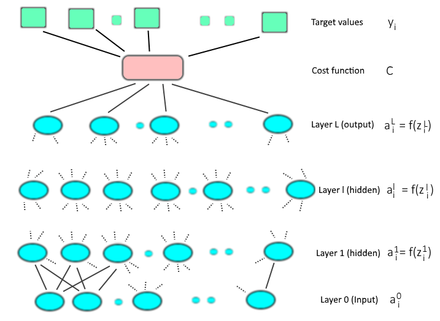
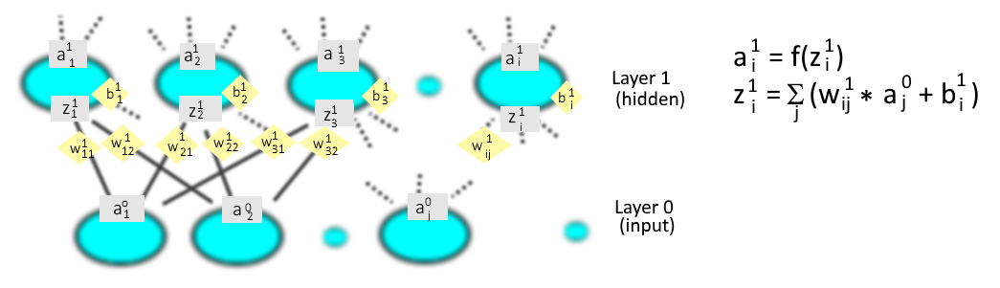

# ML Basic C Specification

**Machine Learning Basics in C++**

Copyright (c) Pius Braun 2018

[TOC]

------

## Components of the Neural Network

This picture shows the draft of a fully connected neural network an the additional cost function and target values that are needed for the so called "supervised learning". 

 

Between every layer of the network there are weights and biases. These are the values that have to be adjusted by the training process.

The following picture is a detail of the above network, showing weights and biases. Note that the "higher" layer's index takes the first position in the subscript of each weight, e.g. $w^1_{11}$, $w^1_{12}$ etc.  

 

***Notation***

| Element            | Explanation                                                  |
| ------------------ | ------------------------------------------------------------ |
| $y_i$              | target value for output neuron $i$                           |
| C                  | The cost function. The implementation supports these cost functions: Quadratic:				 $C = \frac{1}{2} \sum\limits_i(y_i-a^L_i )^2$  Binary Cross Entropy:		 $C = -\sum\limits_i [y_i*ln(a^L_i) + (1-y_i)*ln(1-a^L_i)]$  Multiclass Cross Entropy:	 $C = -ln(a^L_{y_i})$,   	where $a^L_{y_i}$ is the output of the $i^{th}$ neuron, where the vector of  					target values $y$ is 1 |
| $a^l_i = f(z^l_i)$ | Output of the $i^{th}$ neuron in the layer $1 .. L$  as a function of the neuron's input. The implementation supports these types of neurons: 	Linear:		 $a^l_i= z^l_i$  	Sigmoid:		 $a^l_i=\frac{1}{1+e^{-z_i}}$  	Softmax:	  $a^l_i=\frac{e^{z_i}}{\sum\limits_ie^{z_i}}$ |
| $z^l_i$            | Input to the $i^{th}$ neuron in layer $l$. $z^l_i = \sum\limits_i(w^l_{ij} * a^{l-1}_j + b^l_i)$ |
| $w^l_{ij}$         | Weights (a matrix) between layer $(l)$ and layer $(l-1)$     |
| $b^l_i$            | Biases (a vector) for the neurons in layer $(l)$             |

> **Note:** The subscript index $elem_i$ has a different range in every layer, so it always has to be considered in combination with of the respective layer: $elem^l_i$.
>
> **Note:** My implementation uses the multiclass cross entropy function only in combination with a target vector, where all elements are zero except for the right class, which is 1. For a discussion on Binary Cross Entropy and Multiclass Cross Entopy cost function see e.g. [here](https://datascience.stackexchange.com/questions/20296/cross-entropy-loss-explanation) .

-----

## Training Algorithm

The intention of the training algorithm is, to find good weights and biases in the network to minimize the cost function and thus "learn" what is the best output on a specific input. e.g. 

- identify an object in a picture 
- translate a spoken word to text
- find a tumor in a radiograph
- identify a criminal by his motion pattern
- preview a crash while driving
- recommend a product, based on your personal data
- ...

This implementation (which does not solve every problem in the list above equally good) uses the following features for training:

- Backpropagation with stochastic gradient descent
   Minibatch: a sample set of `BATCH_SIZE` elements from the training data
- Weight decay: Any cost function contains an additional factor $sqarednorm$ for normalization

**Note:** Weight decay is a method to avoid "overfitting". See the [References](References.md) for a discussion on that.  

------

## Backpropagation

The target of the training algorithm is, to minimize the cost function $C$ by setting the proper $w^l_{ij}$ and $b^l_i$.  Backpropagation as part of the training algorithm shall find the gradients of the weight and biases. A gradient describe the effect that a change in a single $w^l_{ij}$ or $b^l_i$ has on $C$. In combination with stochastic gradient descent, it (hopefully) stepwise decreases the "costs" of the network. 

In Math, computing the gradient of every weight and bias is a long list of partial derivatives:

> $\frac{\partial C}{\partial w^l_{ij}}$ 	for the weights in every layer $l$ and
> $\frac{\partial C}{\partial b^l_i}$ 		for the biases in every layer $l$.

So for every weight and bias in every layer, the algorithm has to compute the specific derivative.

Since we use weight decay, there are also derivatives from the $sqarednorm$ function.

The backpropagation algorithm goes back to a [publication](https://www.nature.com/articles/323533a0) from 1986. Backpropagation is executed many times, where after each step the weights and biases are adjusted slightly, using a "learning rate" to get closer to the desired result. This is called gradient descent. Many iterations of these steps on a large number of training data are the core of the training alorithm in Machine Learning.  

**Details of backpropagation**

Backpropagation uses the chain rule of differentiation.

In Lagrange notation, it looks like this:

> If we want to derive a function	$f(x)$ to it's derivative $f'(x)$ and if we can express $f(x)$ as a combination of two (or more) functions:
$$
f(x) = u(v(x))
$$
> then
$$
f'(x) = u'(v(x)) * v'(x)
$$
.
> For example
$$
f(x) = sin(x^2)
f'(x) = cos(x^2) * 2x
$$
> where
$$
u(v) = sin(v) \text{ with } u'(v) = cos(v)\\
v(x) = x^2 \text{ with } v'(x) = 2*x
$$
In Leibniz notation, the chain rule looks like this:
$$
\frac{df(x)}{dx} = \frac{du}{dv} * \frac{dv}{dx}
$$
Now let's apply the chain rule to the partial derivatives of the cost function.

**Note:** In order to get a better distinction, I use different subscript letters in every layer. For layer $L$ this is subscript $i$ (e.g. $z^L_i$), for layer $(L-1)$ this is $j$  (e.g. $a^{L-1}_j$ or $w_{jk}^{L-1}$).

When we apply the chain rule on the derivative of the cost function $C$ to the weights $w^L_{ij}$ of the Ouput layer 

$L$ we get:
$$
\frac{\partial C}{\partial w^L_{ij}} = \frac{\partial C}{\partial a_i^L} * \frac{\partial a_i^L}{\partial z_i^L} * \frac{\partial z_i^L}{\partial w_{ij}^L}
$$
Let's go to layer $(L-1)$.
$$
\frac{\partial C}{\partial w^{L-1}_{jk}} = \frac{\partial C}{\partial a_i^L} * \frac{\partial a_i^L}{\partial z_i^L} * \frac{\partial z_i^L}{\partial a_{j}^{L-1}} * \frac{\partial a_j^ {L-1}}{\partial z_{j}^{L-1}} * \frac{\partial z_j^ {L-1}}{\partial w_{jk}^{L-1}}
$$
Layer $(L-2)$:
$$
\frac{\partial C}{\partial w^{L-2}_{kl}} = \frac{\partial C}{\partial a_i^L} * \frac{\partial a_i^L}{\partial z_i^L} * \frac{\partial z_i^L}{\partial a_j^{L-1}} * \frac{\partial a_j^ {L-1}}{\partial z_j^{L-1}} * \frac{\partial z_j^{L-1}}{\partial a_{k}^{L-2}} * \frac{\partial a_k^ {L-2}}{\partial z_k^{L-2}} * \frac{\partial z_k^ {L-2}}{\partial w_{kl}^{L-2}}
$$

and so on.

Let's split the derivatives into similar steps for every layer:

| Layer   | Step 1                                                       | Step 2                                                       | Step 3                                                       |
| ------- | ------------------------------------------------------------ | ------------------------------------------------------------ | ------------------------------------------------------------ |
| $L$     | $\frac{\partial C}{\partial a_i^L} * \frac{\partial a_i^L}{\partial z_i^L}$ | $\frac{\partial z_i^L}{\partial w_{ij}^L}$ and $\frac{\partial z_i^L}{\partial b_i^L}$ |                                                              |
| $L - 1$ | $\frac{\partial C}{\partial a_i^L} * \frac{\partial a_i^L}{\partial z_i^L}$ | $\frac{\partial z_j^ {L-1}}{\partial w_{jk}^{L-1}}$ and $\frac{\partial z_j^ {L-1}}{\partial b_j^{L-1}}$ | $\frac{\partial z_i^L}{\partial a_{j}^{L-1}} * \frac{\partial a_j^ {L-1}}{\partial z_{j}^{L-1}}$ |
| $L - 2$ | $\frac{\partial C}{\partial a_i^L} * \frac{\partial a_i^L}{\partial z_i^L}$ | $\frac{\partial z_k^ {L-2}}{\partial w_{kl}^{L-2}}$ and $\frac{\partial z_k^ {L-2}}{\partial b_k^{L-2}}$ | $\frac{\partial z_i^L}{\partial a_{j}^{L-1}} * \frac{\partial a_j^ {L-1}}{\partial z_{j}^{L-1}} * \frac{\partial z_j^{L-1}}{\partial a_{k}^{L-2}} * \frac{\partial a_k^ {L-2}}{\partial z_k^{L-2}}$ |
| $L - 3$ | ...                                                          | ...                                                          | ...                                                          |

The same split works for the biases, where only the derivatives for the weights in Step 2 have to be replaced by   $\frac{\partial z_i^l}{\partial b_i^l}$.

You can see, that Step 1 is always the same in every layer. So it only has to be computed once, when deriving the cost function to the input values of the ouput layer $L$.

In Step 2, we see the derivatives for the weights or bias.

The first pair of derivatives in Step 3 ($\frac{\partial z_i^l}{\partial a_{j}^{l-1}} * \frac{\partial a_j^ {l-1}}{\partial z_{j}^{l-1}}$) is repeated in every layer, starting from layer $(L-1)$. So when we have computed the term for a layer $l$, we can use the result in the layer $(l-1)$.

The backpropagation algorithm works as follows:

> Step 0: Run the forward propagation (see below) with the current settings for the weights and biases. 

> Step 1: Calculate $\frac{\partial C}{\partial a_i^L} * \frac{\partial a_i^L}{\partial z_i^L}$ and store it to a local variable (a matrix `Delta`$^L$).

> Step 2a: Calculate  $\frac{\partial z_i^L}{\partial w_{ij}^L}$, (using `Delta`$^l$) and store it to a local variable `NablaW`$^L$.

> Step 2b: Calculate  $\frac{\partial z_i^L}{\partial b_{i}^L}$ , (using `Delta`$^l$) and store it to a local variable `NablaB`$^L$.
>
> REPEAT: For every Layer $l$, which is running from Layer $(L-1)$ down to Layer $(1)$
>
> > Step 3: Calculate $\frac{\partial z_i^{l+1}}{\partial a_j^l} * \frac{\partial a_j^l}{\partial z_j^l}$ and store it in a local variable `Delta`$^l$.
> > Step 2a: Calculate $\frac{\partial z_i^l}{\partial w_{ij}^l}$, (using `Delta`$^l$) and store it to a local variable `NablaW`$^l$.
> > Step 2b: Calculate $\frac{\partial z_i^l}{\partial b_{i}^l}$, (using `Delta`$^l$) and store it to a local variable `NablaB`$^l$.

This algorithm is implemented in my C code. The documentation for the [implementation](Implementation.md) describes a few more issues, like handling minibatch, the size of matrices and vectors and storing intermediate results. 

-----

## Derivatives for Cost functions and Neurons

The following section contains the math background for the implemented Machine Learning elements.

### Backpropagation Step 1 derivatives

Let's have a look at the derivatives in backpropagation **Step 1**  $\frac{\partial C}{\partial a_i^L} * \frac{\partial a_i^L}{\partial z_i^L}$.

The first term is the derivative of the cost function to the output layer. I implemented these cost functions:

| Type                      | Function                                                    | Derivative                                                   |
| ------------------------- | ----------------------------------------------------------- | ------------------------------------------------------------ |
| Quadratic                 | $C = \frac{1}{2} \sum\limits_i(y_i-a^L_i )^2$               | $\frac{\partial C}{\partial a_i^L} = (y_i - a^L_i) * (-1) = (a^L_i - y_i)$ |
| Binary Cross Entropy      | $C = - \sum\limits_i [y_i*ln(a^L_i) + (1-y_i)*ln(1-a^L_i)]$ | $\frac{\partial C}{\partial a_i^L} = - (\frac{y_i}{a_i} - \frac{1-y_i}{1-a_i}) = \frac{a_i - y_i}{a_i * (1 - a_i)}$ |
| Multiclasss Cross Entropy | $C = - ln(a^L_{y_i})$                                       | $\frac{\partial C}{\partial a_{y_i}} = - \frac{y_i}{a_i}$  Note: the function is only derived for $a_i$ where $y_i$ is $1$. In all other cases, the derivative is $0$, since $y_i$ is $0$. |

The second term in Step 1 is the derivative of the neuron function. The following neurons are implemented: 

| Type    | Function                                      | Derivative                                                  |
| ------- | --------------------------------------------- | ----------------------------------------------------------- |
| Linear  | $a_i = z_i$                                   | $\frac{\partial a_i}{\partial z_i} = 1$                     |
| Sigmoid | $a_i = \frac{1}{1+e^{-z_i}}$                  | $\frac{\partial a_i}{\partial z_i} = a_i * (1 - a_i)$       |
| Softmax | $a_i = \frac{e^{z_i}}{\sum\limits_i e^{z_i}}$ | $\frac{\partial a_i}{\partial z_j}=a_i*(\partial_{ij}-a_j)$ |

> **Note:** The derivative of the Softmax neuron is explained on Eli Bendersky's [website](https://eli.thegreenplace.net/2016/the-softmax-function-and-its-derivative/). You have to understand, that the Softmax is a vector function with (in our notation) a vector $z$ as input and a vetor $a$ as output. The partial derivatives from output $i$ to input $j$ are not single values, but a matrix, where the Neuron $i$ has a vector of derivatives. The derivatives are $a_i*(1-a_j)$ for $(i=j)$ and  $-a_j*a_i$ for $i \neq j$ . The notation abovr uses the Kronecker Delta function $\partial_{ij}$. 
>
> For 3 softmax neurons ($i=1..3$) with 3 inputs ($j=1..3$) the result is a matrix with the following partial derivatives:
$$
\begin{matrix} a_1(1-a_1) & -a_1a_2 & -a_1a_3 \\ -a_2a_1 & a_2(1-a_2) & -a_2a_3 \\ -a_3a_1 & -a_3a_2 & a_3(1-a_3) \end{matrix}
$$

> Since the derivative of the cost function is only relavant for the neuron, where the target value is $1$, we use only the derivative vector where where  $y_i = 1$. In the matrix above, it is the column vector.

Not all combinations of cost function and type of neuron in the output layer are available in the implementation. The following combinations are implemented:

| Cost Function            | Output Layer Neuron | Step 1 derivative $\frac{\partial C}{\partial a_i^L} * \frac{\partial a_i^L}{\partial z_i^L}$ |
| ------------------------ | ------------------- | ------------------------------------------------------------ |
| Quadratic                | Linear              | $(a_i-y_i)*1=a_i-y_i$                                        |
| Quadratic                | Sigmoid             | $(a_i - y_i)*a_i*(1-a_i)$                                    |
| Binary Cross Entropy     | Sigmoid             | $\frac{a_i-y_i}{a_i*(1-a_i)}*(a_i*(1-a_i))=a_i-y_i$          |
| Multiclass Cross Entropy | Softmax             | $-\frac{y_i}{a_i}*a_i*(\partial_{ij}-a_j) = a_j-\partial_{ij}$ where $y_i$ is $1$. |

### Backpropagation Step 2 derivatives

The derivatives of the neuron input vectors to the weights an biases are the derivatives of the function: 
$$
z^l_i = \sum\limits_j(w^l_{ij} * a^{l-1}_j + b^l_i)
$$

The derivatives are quite simple:

| Element | Step 2 derivative                                      |
| ------- | ------------------------------------------------------ |
| Weights | $\frac{\partial z^l_i}{\partial w^l_{ij}} = a^{l-1}_j$ |
| Biases  | $\frac{\partial z^l_i}{\partial b^l_i} = 1$            |

### Backpropagation Step 3 derivatives

The derivatives in Step 3 $\frac{\partial z_i^L}{\partial a_{j}^{L-1}} * \frac{\partial a_j^ {L-1}}{\partial z_{j}^{L-1}}$ are only applicable for the layers $(L-1)$, the last hidden layer to $(1)$, the first hidden layer. 

For the first term $\frac{\partial z_i^l}{\partial a_{j}^{l-1}}$ we again have a look at the function.
$$
z^l_i = \sum\limits_j(w^l_{ij} * a^{l-1}_j + b^l_i)
$$
The derivative of term 1 is:

$$
\frac{\partial z^l_i}{\partial a^{l-1}_j} = w^l_{ij}
$$

The second term $\frac{\partial a_i^{l-1}}{\partial z_{j}^{l-1}}$ is the derivative of the Neuron function. We use different neurons, but there is a restriction that the Softmax neuron can only be used in the output layer. Since Step 3 is only applicable to a hidden layer, there is no Softmax neuron in any hidden layer. The derivatives for the remaining neuron types Linear and Sigmoid are already described above. As a summary, the Step 3 derivatives are:

| Neuron Type | Step 3 derivative $\frac{\partial z_i^l}{\partial a_{j}^{l-1}} * \frac{\partial a_j^ {l-1}}{\partial z_{j}^{l-1}}$ |
| ----------- | ------------------------------------------------------------ |
| Linear      | $w^l_{ij}*1=w^l_{ij}$                                        |
| Sigmoid     | $w^l_{ij}*a^{l-1}_j*(1-a^{l-1}_j)$                           |

-----

## Forward Propagation

After a training phase using Backpropagation, the training process has to measure the success ot the training. This is done through forward propagation. Forward propagation "runs" the network from the input layer to the output layer and calculates the cost function and the accuracy of it's predictions. Different types of measures can be calculated, depending on the data set, that the network is applied to. In a typical scenario, there are test data which were not used in training, to measure the quality of the network. Details are explained in the desciption of [implementation](implementation.md).

The forward propagation works as follows:

> REPEAT: for every Layer $l$ from Layer $1$  (the first hidden layer) to Layer $L$ (the output layer):
>
> > Step 1: Calculate Layer input $z^l_ i=\sum\limits_j(w^l_{ij} * a^{l-1}_j + b^l_i)$
> >
> > Step 2: Calculate the neuron function of the layer (one of): 
> >
> > > Linear:		 $a^l_i= z^l_i$
> > >
> > > Sigmoid:		 $a^l_i=\frac{1}{1+e^{-z_i}}$
> > >
> > > Softmax:	  $a^l_i=\frac{e^{z_i}}{\sum\limits_ie^{z_i}}$

The calculation of the cost function and/or accuracy is not part of the forward propagation. 

-----

## Stochastic Gradient Descent

The intention of the training algorithm is, to find good weights and biases in the network to minimize the cost function. 

**Weight initialization**

The weights and biases have to be initialized with some random values and then adjusted in many iterations. An initialization of the weights and biases with $0$ (Zero) is not recommended, since we need initial weights as part of the Backpropagation. The initialization uses a random generator to set the weights to some small value betwenn 0.0 and 0.1.

**Minibatch**

The implementation uses all the training data for training. It makes sense to split the training set in a number of chunks (so called minibatches) that are used in the subsequent training loop. The size of the minibatch is seb by the parameter `BATCHSIZE`.

**Weight adjustiment**

In every training loop, the gradient, which is the result of the backpropagation algorithm is used to adjust the initial weights and biases. The grade of adjustment can be modified by a factor, the `LEARNING_RATE`.

**Stochastic gradient descent**

The full algorithm for stochastic gradient descent looks like this:

>  Step 1: Initialize weights and biases with random values

>  Step 2: Split the training data in minibatches using `BATCHSIZE`

>  REPEAT: for every minibatch in the training data

> > Step 3: call backpropagation algorithm

> > Step 4: adjust weights and biases using `LEARNING_RATE`

> > Step 5: call forward propagation algorithm
> >
> > Step 6: calculate measures

-----

This ends the theory & math chapter of my project.

